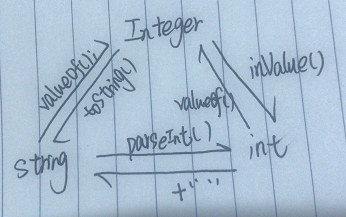

Integer、int 和 String 三种类型互相转换
<!-- more -->

```java
public class IntegerTest04 {
	public static void main(String[] args) {
		// 1. int-->Integer
		Integer i1 = Integer.valueOf(10);

		// 2. Integer-->int
		int i2 = i1.intValue();

		// 3. String-->Integer
		Integer i3 = Integer.valueOf("10");

		// 4. Integer-->String
		String s1 = i3.toString();

		// 5. String-->int
		int i4 = Integer.parseInt("123");

		// 6. int-->String
		String s2 = 10 + "";
	}
}
```

