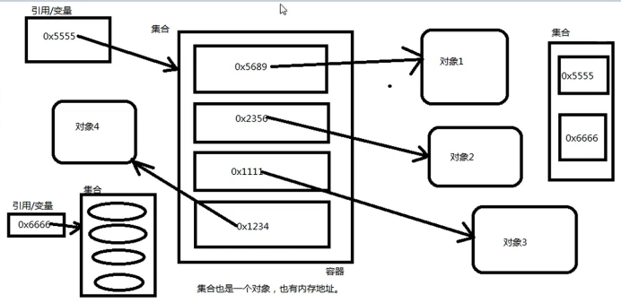

1. 什么是集合？有什么用？
	- 数组其实就是一个集合，集合实际上就是一个容器，可以来容纳其他类型的数据。
	- 集合为什么说在开发中使用较多？
		- 集合是一个容器，是一个载体，可以一次容纳多个对象。
		- 在实际开发中，假设连接数据库，数据库当中有10条记录，那么假设把这10条记录查询出来，在 Java 程序中会将10条数据封装成10个 Java 对象，然后将10个 Java 对象放到某一个集合当中，将集合传到前端，然后遍历集合，将一个数据一个数据展现出来。
	
	<!-- more -->

2. 集合不能直接存储基本数据类型，另外集合也不能直接存储 Java 对象，集合当中存储的都是 Java 对象的内存地址。（或者说**集合中存储的是引用。**）
   - 注意：
     - 集合在 Java 中本身是一个容器，是一个对象。
     - 集合中任何时候存储的都是“引用”。

3. 在 Java 中每一个不同的集合，底层会对应不同的数据结构。往不同的集合中存储元素，等于将数据放到了不同的数据结构当中。数据结构就是数据存储的结构。不同的数据结构，数据存储方式不同。例如：数组、二叉树、链表、哈希表...**使用不同的集合等同于使用了不同的数据结构。**
   - `new ArrayList();` 创建一个集合对象，底层是数组。
   - `new LinkedList();` 创建一个集合对象，底层是链表。
   - `new TreeSet();` 创建一个集合对象，底层是二叉树。

4. 集合在 Java JDK 中哪个包下》
   - `java.util.*` 所有的集合类和集合接口都在 `java.util` 包下。
5. 在 Java 中集合分为两大类：
   - 单个方式存储元素
     - 超级父接口：`java.util.Collection;`
   - 以键值对方式存储元素
     - 超级父接口：`java.util.Map;`