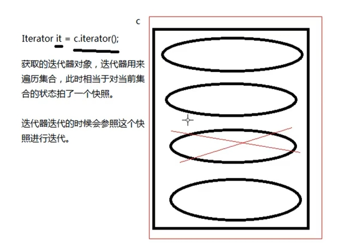

当集合的结构发生改变时，迭代器必须重新获取，如果还是用以前老的迭代器，会出现异常：`java.util.ConcurrentModificationException`

在迭代集合元素的过程中，不能调用集合对象的 remove 方法，删除元素：c.remove(o); 迭代过程中不能这样，会出现： `java.util.ConcurrentModificationException`

在迭代元素的过程当中，一**定要使用迭代器 Iterator 的 remove 方法，删除元素**，不要使用集合自带的 remove 方法删除元素

<!-- more -->

```java
]import java.util.ArrayList;
import java.util.Collection;
import java.util.Iterator;

public class CollectionTest06 {

	public static void main(String[] args) {
		// 创建集合
		Collection c = new ArrayList();

		// 注意：此时获取的迭代器，指向的是集合没有元素状态下的迭代器
		// 一定注意：集合结构只要发生改变，迭代器必须重新获取
		// 当集合结构发生了改变，迭代器没有重新获取时，调用 next()
		// 方法会报异常：java.util.ConcurrentModificationException
		// Iterator it = c.iterator();

		// 添加元素
		c.add(1);
		c.add(2);
		c.add(3);
		// 获取迭代器
		Iterator it = c.iterator();
		while (it.hasNext()) {
			// 编写代码时 next() 方法返回值类型必须是 Object
			// Integer i = it.next();
			Object obj = it.next();

			// 删除元素
			// 删除元素之后，集合的结构发生了变化，应该重新去获取迭代器
			// 但是，循环下一次的时候并没有重新获取迭代器，所以会出现异常：java.util.ConcurrentModificationException
			// 出异常根本原因是：集合中元素删除了，但是没有更新迭代器（迭代器不知道集合变化了）
			// c.remove(obj); // 直接通过集合去删除元素，没有通知迭代器（导致迭代器的快照和集合状态不同）

			// 所以需要使用迭代器的 remove() 删除
			// 使用迭代器去删除时，会自动更新迭代器，并且更新集合（删除集合中的元素）
			it.remove(); // 删除的一定是迭代器指向的当前元素

			System.out.println(obj);
		}

		System.out.println(c.size()); // 0
	}
}
```

