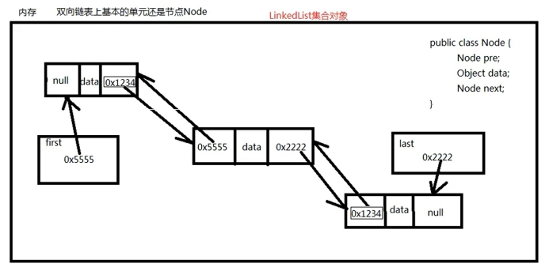

LinkedList 集合底层采用了双向链表数据结构：

1. LinkedList 集合是双向链表
2. 对于链表数据结构来说，随机增删效率较高，检索效率较低
3. 链表中的元素在空间存储上，内存地址不连续

<!-- more -->




LinkedList 集合的 add() 方法源码如下：

```java
public boolean add(E e) {
	linkLast(e);
	return true;
}

void linkLast(E e) {
	final Node<E> l = last;
	final Node<E> newNode = new Node<>(l, e, null);
	last = newNode;
	if(l == null)
		first  = newNode;
	else 
		l.next = newNode;
	size++;
	modCount++;
}
```


```java
import java.util.LinkedList;
import java.util.List;

public class LinkedListTest02 {

	public static void main(String[] args) {
		List list = new LinkedList();
		list.add("a");
		list.add("b");
		list.add("c");

		for (int i = 0; i < list.size(); i++) {
			Object obj = list.get(i);
			System.out.println(obj);
		}

		// LinkedList 集合没有初始化容量
		// 最初这个链表中没有任何元素，first 和 last 引用都是 null
		// 不管是 LinkedList 还是 ArrayList ，以后写代码时不需要关心具体是哪个集合
		// 因为我们要面向接口编程，调用的方法都是接口中的方法
		// List list2 = new ArrayList(); // 这样写表示底层用了数组
		List list2 = new LinkedList(); // 这样写表示底层用了双向链表
		list2.add(1);
		list2.add(2);
		list2.add(3);
		for (int i = 0; i < list2.size(); i++) {
			System.out.println(list2.get(i));
		}
	}
}

```

