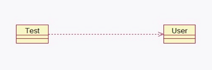

1. 依赖关系是比关联关系弱的关系，在 java 语言中体现为返回值，参数，局 部变量和静态方法调用
2. 用**一套带箭头的虚线**表示

<!-- more -->



```java
public class Test {
    public void m1() {
        // 局部变量
        User u = new User(); // 依赖关系
    }
}

class User{}
```

