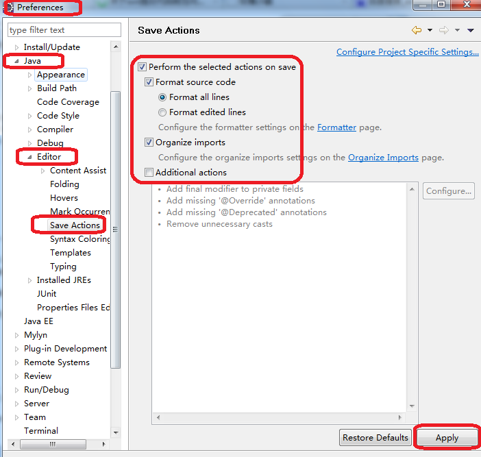

关于Java的集成开发环境【集成开发环境简称：IDE】，下面介绍 eclipse 的使用

<!-- more -->

## workspace:工作区
 - 当 eclipse 打开的时候，大多数都是会提示选择工作区
 - 这个工作区可以是已存在的工作区，也可以是新建的工作区
 - 选择工作区之后，将来编写的java代码，自动编译的class文件都会在工作区中找到
 - myeclipse可以开启两个甚至更多的会话，每一个会话对应不同的workspace

工作区workspace中基本的单元是：**Project**（工程/项目）

### .metadata文件夹

在workspace工作区当中有一个文件夹：`.metadata`

- **在该文件夹当中存储了当前 eclipse 的工作状态**

- 将 .metadata 文件夹删除之后，下一次再次进入这个工作区的时候，是一个全新的开始。
但是会发现这个IDE工具当中所有的项目丢失了，没关系，这里只是丢失的 `eclipse` 的项目，
硬盘上真实存储的项目不会丢失

## 窗口

打开myeclipse之后
 - 窗口双击可以最大化或者还原
 - 窗口可以拖动
	- 窗口不小心关闭了，可以再次打开：
	`window --> show view --> Other --> 输入自己要找的窗口`

## 布局方式

- 企业级开发：`JavaEE 开发的专用布局- MyEclipse Java Enterprise`
- 普通java开发的：`JavaSE 开发的专用布局 - Java`
- 怎么切换布局？
	* eclipse 右上角，点击 `Open Perspective`

当这个布局被破坏之后想复原？

 `window --> Perspective --> Reset Perspective`

## 重点的窗口介绍
- Package Explore / Navigator / Project Explore ：可以看到 Java 源文件
- Console：控制台窗口

## 创建工程

在 Package Explor 窗口当中`点击右键 --> new --> Java Project【JavaSE工程】`：当然还有其它方式
- 指定 java 工程的名称：一般全部小写
- 指定 java 工程的存放目录
- Java 的运行时环境：JRE的配置【可以选择使用 eclipse 自带的 JRE，也可以选择程序员自己安装的 JRE】
- Project layout : 工程的目录布局
- 多数情况下都是选择：两个独立的文件夹存储源码(src)和字节码(bin)

### 新建软件包

- 在 src 目录上`点击右键 --> new --> package`
- 给 package 起名：com.bjpowernode.javase;

### 新建 Java 类

- 在包上`点击鼠标右键 --> new --> class`
- 可以在下面勾选项，如 生成 main 方法

## 快捷键

- ctrl + d 删除一行
- alt + / 自动补全
- ctrl + 1 纠错
- ctrl + alt + down 复制一行，往下粘贴
- ctrl + o 查看方法名
- ctrl + / 单行注释
- ctrl + shift + / 多行注释
- alt + shift + a 快速编辑，支持多行同时编辑：块编辑；还可以在上面的 icon 选中使用，标有：Toggle Block Selection Mode
- ctrl + shift + t 查找类型【Open Type】
- ctrl + shift + r 查找资源【Open Resource】
- ctrl + shift + o 导入类
- 先敲 sysout，然后组合快捷键：alt+/ ===> System.out.println()

**注意：eclipse当中的 java 源代码有的时候不保存是不会编译的。所以时刻记住：ctrl + s**

## 运行一个带有主方法的java程序

- 在java源程序的任何位置点击鼠标右键 --> Run As --> Java Application
- 点击上面的小icon

## 保存自动格式化

`windows-->Preferences-->Java --> Editor-->Save Actions`, 勾选“Perform the selected actions on save”，其他选项根据需要自己选择或者配置就可以了

最后 Apply 和 Ok 一下

## 怎么链接源码

打开某个 .class 字节码文件，当没有看到源码的时候

- 点击“Attached Source”
  - Workspace ... 【源码在当前的工作区当中】
  - External File ... 【源码在某个压缩包当中】
  - External Folder ... 【源码在某个目录当中】

## 编辑 注释 模板

`Window->Preference->Java->Code Style->Code Template`

[对各类型的注释模板进行编辑](https://www.cnblogs.com/Durant2035/p/10827431.html)