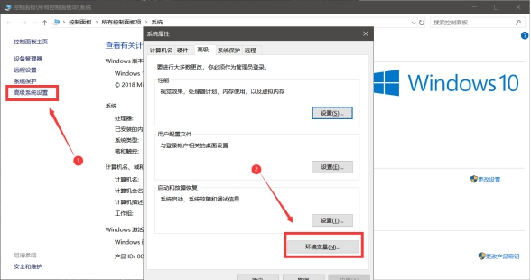
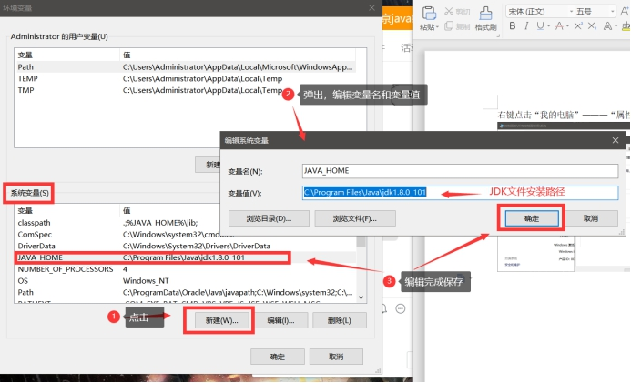
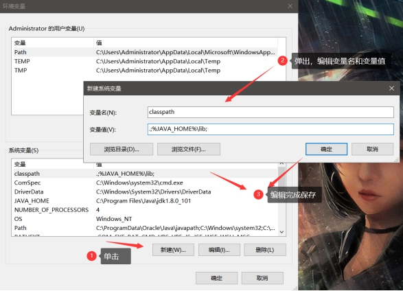
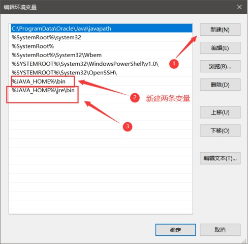
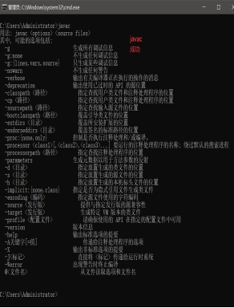

## 前言

Java 如何配置环境变量

<!-- more-->

## 原理

windows操作系统在查找某个命令的时候是怎么查找的？

1. 首先会从当前目录下找这个命令
2. 当前目录下不存在这个命令的话，会去环境变量path指定的路径当中查找该命令
3. 还是找不到则出现错误提示信息

## 配置方法

1. 右键点击“我的电脑”———“属性”——左上角点击“高级系统设置”

 

 

2. 配置 `JAVA_HOME`,  参考下图  新建 **系统变量** 不是用户变量

- 变量名 `JAVA_HOME`

- 变量值 `C:\Program Files\Java\jdk1.8.0_101`

 

 

3. 配置`classpath`，参考下图  变量值的 .;  都要复制

- 变量名 `classpath`

- 变量值 `.;%JAVA_HOME%\lib;`

 

 

4. 编辑`path`变量  参考下图一和图二

 

系统变量中找到 path变量  双击  弹出编辑窗口，添加两条变量，分别为

`%JAVA_HOME%\bin`

`%JAVA_HOME%\jre\bin`

 

 

 

5. 完成检测

打开 CMD，分别输入 

`Java  回车  测试`

`Javac  回车  测试`

如失败则显示‘不是内部命令也不是外部命令’。如成功，结果如下

 