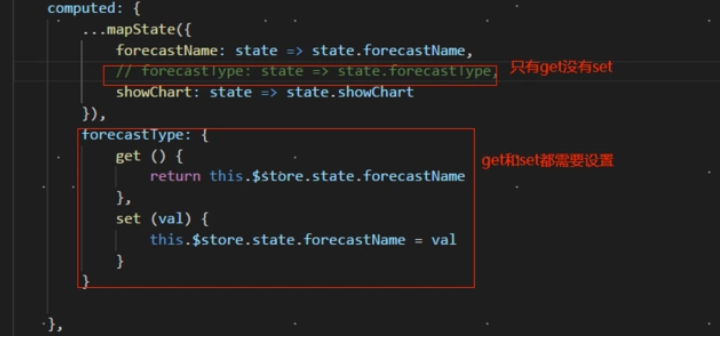

报错原因：
1. 组件中 v-model = 'xxx'，而 xxx 是 vuex state 中的某个变量
2. vuex 是单项流，v-model 是 vue 的双向绑定，但是在 computed 中只通过 get 获取参数值，**没有 set**，所以无法改变参数值

<!-- more -->

解决办法：

1. 在 computed 中添加 get 和 set

   

2. 将 v-model 改成 :value