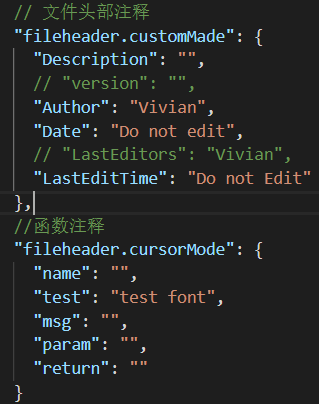
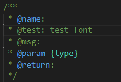
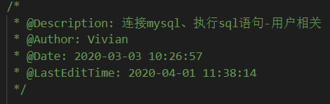

本文记录使用 `KoroFileHeader` 插件完成自动生成文件头部注释和函数注释的功能

<!-- more -->


### 安装与设置

1. 在 vscode 中安装好 `KoroFileHeader` 插件

2. 在vscode左下角点击设置按钮，选择“设置”，然后输入`fileheader`
   - 文件头部注释：**Fileheader:custom Made**
   - 函数注释：**Fileheader:cursor Mode**
   
3. 随便点击哪个在 `setting.json` 中编辑，输入以下设置后保存，然后重启 vscode 更新设置

   

```json
// 文件头部注释
"fileheader.customMade": {
    "Description": "",
    // "version": "",
    "Author": "Vivian",
    "Date": "Do not edit",
    // "LastEditors": "Vivian",
    "LastEditTime": "Do not Edit"
},
//函数注释
"fileheader.cursorMode": {
    "name": "",
    "test": "test font",
    "msg": "",
    "param": "",
    "return": ""
}
```


### 使用

**函数头部注释**

1. 快捷键：**crtl+alt+i（window）**,**ctrl+cmd+t (mac)**
2. 生成样式如下：



**文件头部注释**

1. 快捷键：**crtl+alt+i（window）**,**ctrl+cmd+t (mac)**
2. 生成样式如下：

