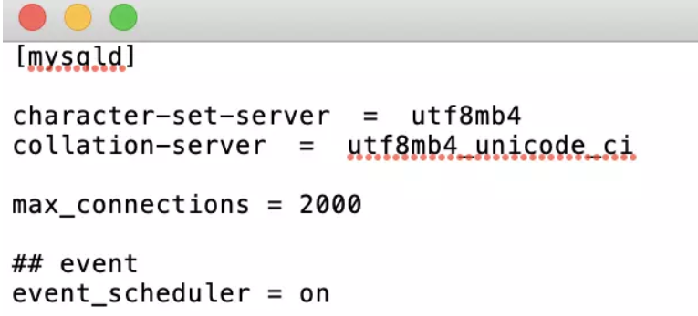

1. 可以使用以下命令查看数据库是否开启 `event_scheduler`

   ```mysql
   SHOW VARIABLES LIKE 'event_scheduler'
   ```

2. 使用命令开启（临时开启，重启mysql又还原回去了）

   ```mysql
    set global event_scheduler = on;
   ```

3. 修改配置（永久修改）

   进入服务器，输入`vim /etc/my.cnf`，**在 [mysqld] 部分加上 event_scheduler=ON 即可**

