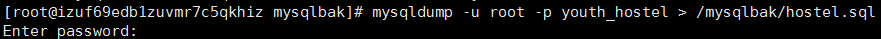
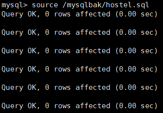

本文介绍 MySQL 数据库简单备份、定时备份与还原

<!-- more -->


## 简单备份

```bash
mysqldump -u root -p 数据库名称 > 具体备份路径
# 例如：
mysqldump -u root -p youth_hostel > /mysqlbak/hostel.sql
```




## 定时备份

1. 创建备份目录

   ```bash
   # root 用户,创建备份目录
   mkdir -p /mysqlbak
   ```

2. 编写运行脚本 `vi /usr/sbin/bakmysql.sh`

   ```bash
   me:bakmysql.sh
   # This is a ShellScript For Auto DB Backup and Delete old Backup
   #
   
   # Database info
   DB_USER="root"                          # mysql login name
   DB_PASS="123456"                        # password
   DB_HOST="localhost"                     # db_address
   DB_NAME="youth_hostel"                  # db_name
   DB_ZFBM="--default-character-set=utf8"  # character
   #DB_TABLE="exam_quest_bank"             # table name
   
   # Others vars
   BIN_DIR="/usr/bin"                      # the mysql bin path
   BCK_DIR="/mysqlbak"                     # the backup file directory
   DATE=`date +%F`
   
   #--skip-lock-tables      zg backup
   #$BIN_DIR/mysqldump -u $DB_USER -p$DB_PASS  $DB_ZFBM  $DB_NAME  $DB_TABLE | gzip > $BCK_DIR/db_$DATE.sql.gz
   
   #data beifen
   $BIN_DIR/mysqldump --opt -u$DB_USER -p$DB_PASS -h$DB_HOST  $DB_ZFBM  $DB_NAME | gzip > $BCK_DIR/db_$DATE.sql.gz
   
   #sql back
   #$BIN_DIR/mysqldump --opt -u$DB_USER -p$DB_PASS -h$DB_HOST $DB_ZFBM  $DB_NAME  $DB_TABLE > $BCK_DIR/db_$DATE.sql
   
   #find $BCK_DIR -name "db_*.sql" -type f -mtime +3 -exec rm {} \; > /dev/null 2>&1
   find $BCK_DIR -name "db_*.gz" -type f -mtime +3 -exec rm {} \; > /dev/null 2>&1
   ```
   

脚本说明：

- $BIN_DIR  mysql备份地址
   - $DB_USER  数据库用户名
   
- $DB_PASS   数据库密码
  
- $DB_HOST   数据库地址（IP或者是localhost之类的）
  
- $DB_ZFBM   字符集编码设置（这个很关键，解决导出文件中中文乱码）
  
- $DB_NAME  数据库名称
  
- $DB_TABLE  要备份的表名（如果只对单一表进行备份，可以加此字段，全库备份的可以省略掉）
  
- $BCK_DIR/db_$DATE.sql   备份的地址和备份文件名称 
  
3. 给脚本文件加权限

    ```bash
    chmod +x /usr/sbin/bakmysql.sh
    ```

4. 执行脚本，验证脚本是否正确，正确的话，备份目录会出现对应日期的文件

    ```bash
    ./bakmysql.sh
    ```

5. 编辑定时任务列表

   ```bash
   crontab -e
   # 输入：
   # 每天早上 5:00am 执行
   00 05 *   * * /bin/sh /usr/sbin/bakmysql.sh
   ```

6. 查看设置的定时任务是否成功

    ```bash
    crontab -l
    ```

    

7. 重启crontab（分别有给出了别的操作命令）

    ```bash
    # 重启
    /bin/systemctl restart crond.service
     
    # 开启
    /bin/systemctl start crond.service
     
    # 停止
    /bin/systemctl stop crond.service
     
    # 重载
    /bin/systemctl reload crond.service
     
    # 状态
    /bin/systemctl status crond.service
    ```

    


### 解释

- 导出的脚本

    ```bash
    #--skip-lock-tables      zg backup
    $BIN_DIR/mysqldump -u $DB_USER -p$DB_PASS  $DB_ZFBM  $DB_NAME  $DB_TABLE | gzip > $BCK_DIR/db_$DATE.sql.gz

    #data beifen
    $BIN_DIR/mysqldump --opt -u$DB_USER -p$DB_PASS -h$DB_HOST  $DB_ZFBM  $DB_NAME | gzip > $BCK_DIR/db_$DATE.sql.gz

    #sql back
    $BIN_DIR/mysqldump --opt -u$DB_USER -p$DB_PASS -h$DB_HOST $DB_ZFBM  $DB_NAME  $DB_TABLE > $BCK_DIR/db_$DATE.sql
    ```
    
    第三条导出的是整个数据库文件，较大，建议使用压缩文件的形式，即第一、二条，导出整个数据库表使用第二条，导出某个数据库表使用第一条（带 $DB_TABLE）
    
- 定时删除备份数据库脚本

  ```bash
  find $BCK_DIR -name "db_*.gz" -type f -mtime +3 -exec rm {} \; > /dev/null 2>&1
  ```

  - `-type f`                    表示查找普通类型的文件，f表示普通文件。
  - `-mtime +3`                按照文件的更改时间来查找文件，+3表示文件更改时间距现在3天以前；如果是 -mmin +5 表示文件更改时间距现在5分钟以前。
  - `-exec rm {} \;`       表示执行一段shell命令，exec选项后面跟随着所要执行的命令或脚本，然后是一对儿{}，一个空格和一个，最后是一个分号。
  - `/dev/null 2>&1`       把标准出错重定向到标准输出，然后扔到/DEV/NULL下面去。通俗的说，就是把所有标准输出和标准出错都扔到垃圾桶里面；其中的& 表示让该命令在后台执行。

-    定时的一些说明：

  - crontab 配置文件格式如下：

       > 分　时　日　月　周　 命令
       >
       > {minute} {hour} {day-of-month} {month} {day-of-week} {full-path-to-shell-script} 
       > - minute:              区间为 0 – 59 
       > - hour:                  区间为 0 – 23 
       > - day-of-month:  区间为 0 – 31 
       > - month:               区间为 1 – 12. 1 是1月. 12是12月. 
       > - Day-of-week:    区间为 0 – 7. 周日可以是0或7.

  - crontab 示例

    > 1. 在 12:01 a.m 运行，即每天凌晨过一分钟。这是一个恰当的进行备份的时间，因为此时系统负载不大。
    >
    >    1 0 * * * /root/bin/backup.sh
    >
    > 2. 每个工作日(Mon – Fri) 11:59 p.m 都进行备份作业。
    >
    >    59 11 * * 1,2,3,4,5 /root/bin/backup.sh
    >
    >    59 11 * * 1-5 /root/bin/backup.sh
    >
    > 3. 每5分钟运行一次命令
    >
    >    */5 * * * * /root/bin/check-status.sh
    >
    > 4. 每个月的第一天 1:10 p.m 运行
    >
    >    10 13 1 * * /root/bin/full-backup.sh
    >
    > 5. 每个工作日 11 p.m 运行。
    >
    >    0 23 * * 1-5 /root/bin/incremental-backup.sh

    

## 还原数据库

```bash
mysql -u root -p
# 根据提示输入密码后进入mysql控制台
show databases;
# 创建数据库
create database mysite;
# 进入数据库
use mysite;
# 从文件导入所有数据
source /mysqlbak/hostel.sql

# 注意：如果备份的数据库是 gz文件，需要实现解压：gzip -d file.sql.gz
```




## 参考文章

[linux定时备份mysql并同步到其它服务器](https://www.cnblogs.com/ityouknow/p/5923489.html)

[Linux下Mysql的数据库备份（基于 CentOS 7.4 64位）](https://blog.csdn.net/u014135369/article/details/81302526)

[crontab 定时任务时间格式设置](https://blog.csdn.net/resilient/article/details/80963526)